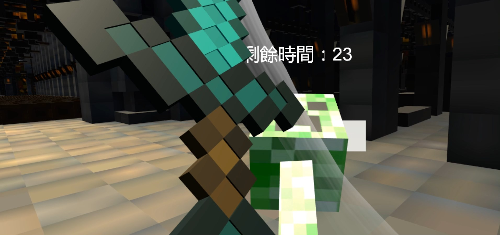
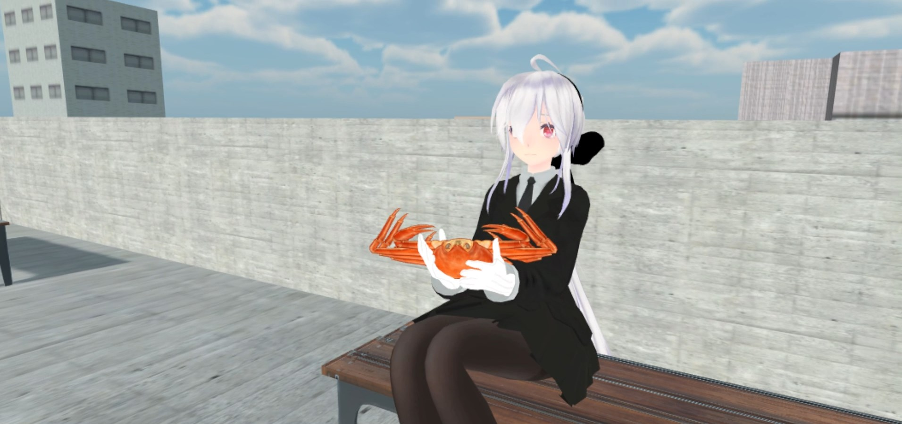
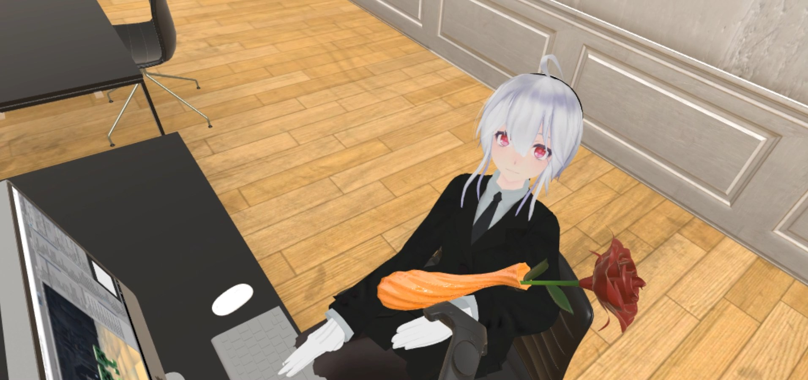
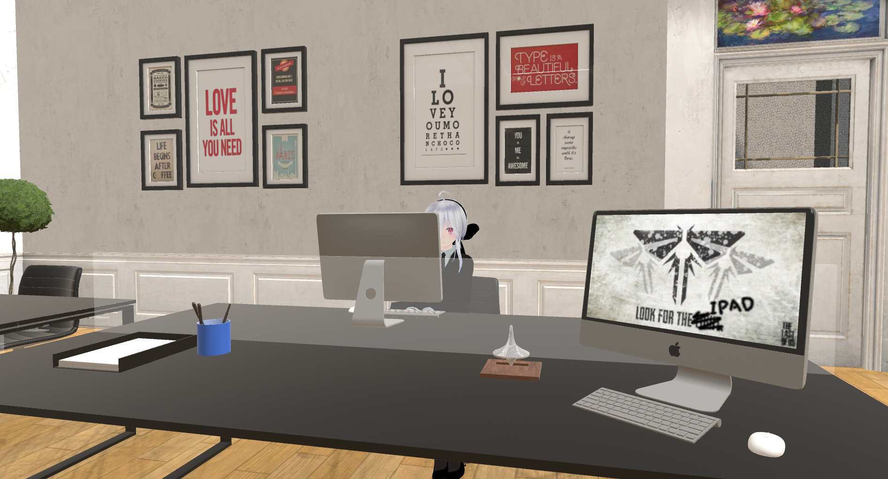

# Project-Haku

Waifu Simulator

 

##  From Developers:
    
    這是我們 MPY 三人在 國立交通大學 虛擬實境與擴充實境 做出來的作品。
    
    此 Repo 僅用來記錄一些與 Project Haku 有關的事物。

    這是我們第一次嘗試做 Vive 的作品，希望您會喜歡。

    如果對遊戲有興趣想要遊玩，請寄信給 此 Repo 的作者 :)
    

 

## Previews:

## Miscellaneous: 

- Dynamic Wallpaper: [動態桌布](https://github.com/yanagiragi/Project-Haku-Desktop)

- Devs Log: [開發Log](https://github.com/yanagiragi/ProjectHaku_UpdateList)

- Posters: [海報](/pdf/Haku%20Poster.pdf)

- Final Presentations: [期末發表簡報](/pdf/Final%20Presentation.pdf)

- Developments Talk: [期末分享Talk簡報](/pdf/Project%20Haku%20Development.pdf)

## Developers:

- @Maybo

- [@po-hsiang](https://github.com/po-hsiang)

- [@yanagiragi](https://github.com/yanagiragi)

## Copyrights

- 基於考慮，將可能有版權疑慮的文件都加到.gitignore了，請自行去觀看。

- 另外，本人及本團隊不擁有 ProjectHaku_MPY_Version9.9/Assets/Resources/Textures 下素材的版權，大部分素材皆來自Unity Assets Store及網路。
